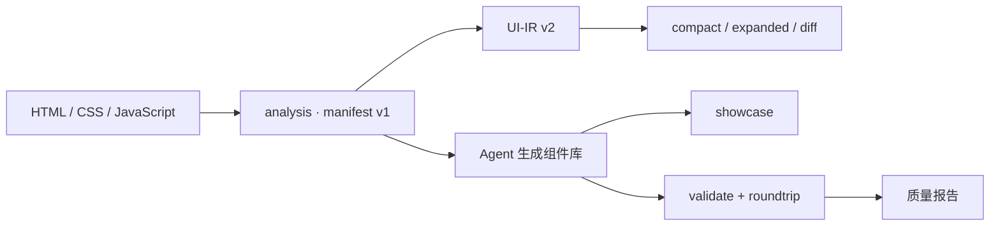

# ui-dismantler

将 HTML 案例拆解为可复用、可验证的组件库。Agent 负责理解页面与生成代码，确定性工具负责结构提取、UI 关系建模、展示页生成和质量校验。

## 核心工作流

1. 阅读原始 HTML，识别视觉系统、组件、数据、交互和响应式行为。
2. 运行分析工具生成 manifest；必要时投影为 UI-IR v2。
3. 生成数据驱动的 CSS、JavaScript、示例页、设计规范和 showcase。
4. 运行约束校验、JavaScript 语法检查和 roundtrip 等价度测试。
5. 根据报告迭代，直到达到质量门槛。

## 架构

仓库分为三个明确层次：

| 层 | 目录 | 职责 |
|---|---|---|
| 核心实现 | `src/ui_dismantler/` | 可导入、可测试的 Python 工具包 |
| Skill 适配 | `src/skill/` | Agent 指令、参考资料、模板和兼容 CLI |
| 工程验证 | `scripts/`、`tests/`、`docs/baselines/` | roundtrip、批量验证、测试与基线 |

`src/skill/scripts/*.py` 是稳定兼容入口，实际实现位于 `src/ui_dismantler/`。新增功能应进入核心包，不再把业务逻辑写入兼容脚本。



详细边界与依赖方向见 [`docs/architecture/overview.md`](docs/architecture/overview.md)。

## 目录

```text
ui-dismantler/
├── src/
│   ├── ui_dismantler/        # 核心 Python 包
│   │   ├── analysis/          # HTML -> manifest
│   │   ├── uiir/             # UI-IR 模型、投影与证据提取
│   │   ├── generation/       # 组件库、showcase 与输出适配
│   │   ├── validation/       # 组件库约束校验
│   │   ├── aggregation/      # 多案例垂类聚合
│   │   └── core/             # 共享 CSS/颜色/数据解析工具
│   └── skill/                # Agent Skill、模板、Schema、兼容脚本
├── scripts/                  # 工程级测试与 roundtrip 命令
├── tests/
│   ├── unit/                 # 纯函数、模型与 CLI 测试
│   ├── integration/          # 浏览器与页面形态回归
│   └── fixtures/             # 可迁移页面夹具
├── docs/
│   ├── architecture/         # 架构与 UI-IR 设计
│   ├── guides/               # 开发和测试说明
│   └── baselines/            # manifest、runtime、roundtrip 基线
└── examples/cases/           # 原始案例页
```

## 快速开始

```bash
# Python 基础依赖
python3 -m pip install -r requirements.txt

# Node.js roundtrip 依赖
npm install

# 1. HTML -> manifest
python3 src/skill/scripts/analyze_html.py \
  examples/cases/blackpink/original.html \
  --out /tmp/blackpink.manifest.json \
  --minimal

# 2. manifest -> UI-IR v2
python3 src/skill/scripts/manifest_v1_to_uiir.py \
  /tmp/blackpink.manifest.json \
  --out /tmp/blackpink.uiir.json \
  --pretty

# 3. 校验生成的组件库
python3 src/skill/scripts/validate_lib.py <组件库目录>

# 4. roundtrip 等价度
python3 scripts/roundtrip.py <原始 HTML> --lib <组件库目录> --out <报告.json>

# 5. 完整测试
python3 scripts/test.py
```

运行时事件观察是可选能力：

```bash
python3 -m pip install -r requirements-runtime.txt
python3 -m playwright install chromium
```

## 主要入口

| 命令 | 用途 |
|---|---|
| `src/skill/scripts/analyze_html.py` | HTML -> manifest v1 |
| `src/skill/scripts/manifest_v1_to_uiir.py` | manifest v1 -> canonical UI-IR v2 |
| `src/skill/scripts/uiir_to_compact.py` | UI-IR -> 面向 Agent 的紧凑观察 |
| `src/skill/scripts/generate_showcase.py` | 从组件库 CSS 生成 showcase |
| `src/skill/scripts/validate_lib.py` | 执行 8 项组件库强约束校验 |
| `scripts/roundtrip.py` | 对比原页面与组件库渲染结果 |
| `scripts/verify_all.py` | 批量执行案例回归 |
| `scripts/test.py` | 运行全部单元与集成测试 |

## 质量门槛

- `validate_lib.py`：8 项全部通过。
- `node --check`：生成的 JavaScript 无语法错误。
- roundtrip：PASS `overall >= 0.70`；GOLD `overall >= 0.85`。
- 工具层：当前 192 项测试通过后才可继续迭代。

## 文档

- [`docs/README.md`](docs/README.md)：文档索引。
- [`docs/architecture/overview.md`](docs/architecture/overview.md)：整体架构与模块职责。
- [`docs/architecture/ui-ir-v2.md`](docs/architecture/ui-ir-v2.md)：UI-IR v2 模型、证据和 CLI。
- [`docs/guides/development.md`](docs/guides/development.md)：开发、测试与兼容约定。
- [`docs/ROADMAP.md`](docs/ROADMAP.md)：演进路线与已完成工作。
- [`src/skill/SKILL.md`](src/skill/SKILL.md)：Agent 完整执行规范。
