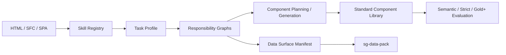

<div align="center">
  

  <p><strong>English</strong> · <a href="README.zh-CN.md">简体中文</a></p>

  <p>
    
    
    
  </p>

  <p>
    <strong>Turn static HTML, Vue SFCs, and SPAs into reusable, reviewable, and verifiable component-library artifacts.</strong>
  </p>
</div>

`ui-dismantler` is an evidence-first frontend analysis and production toolkit. It does not try to clone screenshots or accumulate case-specific rules. Instead, it builds a deterministic pipeline from source inspection to responsibility modeling, component planning, materialization, and quality validation.

```text
HTML / SFC / SPA
    → structure, state, interaction, route, and API responsibility analysis
    → Skill execution and Task Profile planning
    → component candidates, build plans, and data-surface contracts
    → runtime, semantic, strict, roundtrip, visual, and Gold+ validation
    → reusable component library
```

> [!IMPORTANT]
> `ui-dismantler` owns component analysis and production. Business-data normalization, aliases, relations, stages, content modeling, Data Packs, and data adapters belong to [`sg-data-pack`](docs/architecture/data-boundary.md). The **Data Surface Manifest** is the boundary contract between the two systems.

## At a glance

<table>
<tr>
<td width="33%">

### 🧭 Evidence-first

Every reusable conclusion is backed by source evidence, reviewed bindings, explicit blockers, and deterministic artifacts.

</td>
<td width="33%">

### 🧩 Composable Skills

Small capabilities declare inputs, outputs, dependencies, quality gates, and side effects through a shared Skill contract.

</td>
<td width="33%">

### 🗺️ Task Profiles

Profiles compose Skills into reviewable plans for source pages, SPAs, data-backed applications, primitive DOM, and component libraries.

</td>
</tr>
<tr>
<td width="33%">

### 🏗️ Production pipeline

Reviewed plans can materialize components, styles, runtime behavior, provenance, examples, and quality reports.

</td>
<td width="33%">

### 🛡️ Quality gates

Static, runtime, roundtrip, route, network, visual, and browser-stability checks protect the generated library.

</td>
<td width="33%">

### 🔒 Explicit boundaries

Publishable component runtime stays separate from fixtures, examples, business records, and Data Pack ownership.

</td>
</tr>
</table>

## How it works


1. **Inspect** — read HTML, DOM, CSS, assets, Vue SFCs, routes, stores, handlers, proxy configuration, and API clues.
2. **Model** — emit source manifests, responsibility graphs, execution evidence, reviewed artifact bindings, and unresolved blockers.
3. **Plan** — resolve Skill dependencies or a Task Profile in deterministic topological order.
4. **Produce** — create component candidates, build plans, styles, runtime behavior, provenance, and data-surface contracts.
5. **Verify** — run static, runtime, roundtrip, semantic, strict, visual, Gold+, network, and stability gates.

The project currently focuses on closing and stabilizing this end-to-end production loop. A new Skill should be added only when a reproducible, general-purpose capability gap has been demonstrated.

## Guided installation


The repository is currently configured as a private npm package (`"private": true`), so the supported installation path is **from source** rather than a fictional global package install.

### 1. Check the environment

- [Node.js](https://nodejs.org/) **18 or newer**
- npm with lockfile support
- Python 3 only when running the legacy compatibility tools

```bash
node --version
npm --version
```

### 2. Clone the repository

```bash
git clone https://github.com/SuTang-vain/ui-dismantler.git
cd ui-dismantler
```

### 3. Install dependencies

For local development:

```bash
npm install
```

For a clean, lockfile-exact CI installation:

```bash
npm ci
```

### 4. Build and verify the CLI

```bash
npm run typecheck:ts
npm run build:ts
node dist-ts/cli.js --help
```

A successful help response means the TypeScript CLI is ready.

### 5. Optional Python compatibility setup

The legacy HTML analysis and roundtrip boundary uses Beautiful Soup:

```bash
python3 -m pip install --user beautifulsoup4
```

> [!TIP]
> The installation flow intentionally follows a guided CLI pattern: **check prerequisites → install dependencies → build → verify → run the first command**. It does not advertise a global install until the package is actually published.

## Quick start

### Discover the available capabilities

```bash
node dist-ts/cli.js skill-list
node dist-ts/cli.js profile-list
```

### Analyze a source page

```bash
node dist-ts/cli.js analyze ./page.html \
  --out /tmp/ui-dismantler/manifest.json \
  --minimal
```

### Plan reusable components

```bash
node dist-ts/cli.js plan ./page.html \
  --out /tmp/ui-dismantler/component-plan.json \
  --spec-dir /tmp/ui-dismantler/component-specs
```

### Validate a generated library

```bash
node dist-ts/cli.js validate /absolute/path/to/component-library
```

### Run roundtrip and browser quality checks

```bash
node dist-ts/cli.js roundtrip ./page.html \
  --lib /absolute/path/to/component-library \
  --out /tmp/ui-dismantler/roundtrip-report.json

node dist-ts/cli.js quality ./page.html \
  --lib /absolute/path/to/component-library \
  --visual-artifacts /tmp/ui-dismantler/visual \
  --out /tmp/ui-dismantler/quality-report.json
```

Write screenshots, raw browser reports, and generated libraries to the system temporary directory or `UI_DISMANTLER_ARTIFACT_ROOT`—never into a managed source case.

## Architecture


```mermaid
flowchart LR
  A["HTML / SFC / SPA"] --> B["Skill Registry"]
  B --> C["Task Profile"]
  C --> D["Responsibility Graphs"]
  D --> E["Component Planning / Generation"]
  E --> F["Standard Component Library"]
  F --> G["Semantic / Strict / Gold+ Evaluation"]
  D --> H["Data Surface Manifest"]
  H --> I["sg-data-pack"]
```

### Core runtime

`src-ts/core/` contains only stable, general-purpose infrastructure:

```text
src-ts/core/
├── skills/          Skill contracts, registry, dependency resolution, evidence
├── profiles/        Task Profiles, execution plans, and executor
├── artifacts/       Artifact registry, reviewed bindings, and run roots
├── ast/             Shared line-preserving JavaScript/TypeScript parsing
└── responsibility/  Responsibility graph deltas and conflict blocking
```

### Skill contract

Each Skill declares a shared `SkillManifest`:

```text
id
version
contractVersion
kind
summary
stages
consumes / optionalConsumes
produces
requires / optionalDependencies
qualityGates
sideEffects
```

Skills must use lowercase kebab-case IDs, declare their contracts explicitly, keep raw algorithm output separate from execution evidence, and fail closed when reviewed evidence is missing. Project names, route names, component names, class names, function names, or visible text must never become generic-rule allowlists.

### Built-in Skills

| Skill | Responsibility |
|---|---|
| `source-structure` | HTML/DOM/CSS/assets/responsive structure analysis |
| `state-responsibility` | state, event handlers, and interaction ownership |
| `component-ownership` | reviewed SFC component and slot ownership |
| `primitive-dom` | provenance-preserving Primitive DOM candidates |
| `spa-router` | SPA route, shell, semantic, strict, and navigation contracts |
| `auth-guard` | authentication guard responsibilities |
| `lifecycle-polling` | polling ownership and cleanup responsibilities |
| `transport-proxy` | Vite/Webpack proxy, prefix, target, and rewrite evidence |
| `api-responsibility` | API wrappers, endpoints, consumers, and fixture boundaries |
| `data-cardinality` | collection cardinality, slicing, and repeated-region evidence |
| `data-surface-manifest` | component data-interface contracts without Data Pack generation |
| `component-library-validation` | static validation of generated component libraries |
| `visual-evaluation` | reviewed multi-viewport visual quality evaluation |

See [`docs/architecture/skill-kernel.md`](docs/architecture/skill-kernel.md) for the complete execution and evidence model.

### Task Profiles

| Profile | Purpose |
|---|---|
| `source-page` | Analyze a deterministic source manifest with optional state responsibility evidence |
| `spa-application` | Compose source, state, route-contract, and optional authentication capabilities |
| `data-backed-spa` | Compose route, proxy, API response-flow, cardinality, and Data Surface responsibilities |
| `primitive-dom` | Compile reviewed SFC component structures into Primitive DOM candidates |
| `component-library` | Validate a generated standard component library without importing business fixtures into publishable runtime |

A Profile runs only after its full execution plan passes reviewed-input and dependency checks.

## Run a Skill or Profile

### Execute one Skill

```bash
node dist-ts/cli.js skill-run source-structure \
  --input /tmp/source-structure.input.json \
  --out /tmp/source-manifest.json \
  --evidence-out /tmp/source-structure.evidence.json
```

Example input:

```json
{
  "htmlPath": "/absolute/path/to/page.html",
  "options": {
    "minimal": true
  }
}
```

`skill-run` is intended for isolated capability debugging. It does not automatically execute dependent Skills.

### Plan and execute a Profile

```bash
node dist-ts/cli.js profile-plan /tmp/profile.config.json \
  --out /tmp/profile.plan.json

node dist-ts/cli.js profile-run /tmp/profile.config.json \
  --out /tmp/profile.report.json
```

Minimal source-page configuration:

```json
{
  "schemaVersion": "1.0",
  "profileId": "source-page",
  "enabledOptionalSkills": [],
  "inputProviders": [
    {
      "contract": "html-path",
      "providerId": "reviewed-source",
      "reviewed": true,
      "inputPath": "htmlPath",
      "value": "/absolute/path/to/page.html"
    }
  ]
}
```

Profile reports keep these channels separate:

```text
raw output
SkillExecutionEvidence
artifact references
ResponsibilityGraphDelta
blockers
quality gates
```

## Component-library production

The production path uses a `ComponentLibraryBuildPlan` to combine reviewed structure, style, state, interaction, data-surface, runtime, and provenance evidence before materialization.

```text
ComponentLibraryBuildPlan
  → Materializer
  → Runtime Smoke
  → component-library-validation
  → Roundtrip / Gold+
  → ComponentLibraryBuildReport
```

Create a deterministic build plan:

```bash
node dist-ts/cli.js component-build-plan \
  /absolute/path/to/component-build.config.json \
  --out /tmp/component-library.build-plan.json
```

Materialize and validate it:

```bash
node dist-ts/cli.js component-build \
  /tmp/component-library.build-plan.json \
  --out-dir /tmp/generated-component-library \
  --report /tmp/component-library.build-report.json
```

Every publishable file must include provenance. Fixtures and examples may exist inside the generated project, but they must not be marked as publishable runtime files.

### Standard output shape

```text
<library>/
├── README.md
├── docs/
├── src/
│   ├── components/
│   ├── styles/
│   └── index.*
├── examples/
├── data-surface.manifest.json
├── component-plan.json
├── component-specs/
└── quality-summary.json
```

Framework-specific files may differ, but the output must preserve structural evidence, reusable style tokens, verifiable state and lifecycle behavior, business-data separation, isolated reference/generated runtimes, and auditable unresolved or review states.

## CLI command map

| Area | Commands |
|---|---|
| Discover | `skill-list`, `profile-list` |
| Execute capabilities | `skill-run`, `profile-plan`, `profile-run` |
| Source analysis | `analyze`, `plan`, `sfc-visual-analyze`, `spa-vue-router-analyze` |
| SPA responsibilities | `spa-router`, `spa-auth-analyze`, `transport-proxy-analyze`, `echarts-responsibility-analyze` |
| Data boundary | `data-surface`, `data-surface-validate`, `component-data-surface-candidate` |
| Component candidates | `component-state-candidate`, `component-style-candidate`, `primitive-dom-build-plan` |
| Production | `component-build-plan`, `component-build-enrich`, `component-build`, `component-produce` |
| Quality | `validate`, `roundtrip`, `quality`, `component-library-validation`, `visual-evaluation` |

Run `node dist-ts/cli.js --help` for the full argument reference.

### CLI conventions

- Commands and IDs use kebab-case.
- JSON inputs use `--input` or an explicit configuration file.
- Formal JSON results use `--out`.
- Execution evidence uses a separate `--evidence-out`; it never wraps or changes raw output.
- Exit code `0` means success, `1` means a quality failure or blocked reviewed plan, and `2` means invalid arguments or an execution error.
- Historical commands remain compatible; new capabilities should prefer `skill-*` and `profile-*` entry points.

## Quality model


The quality system covers static component rules, DOM/text roundtrip equivalence, semantic and strict route contracts, navigation integrity, computed styles, reviewed-region pixel differences, runtime/network/resource stability, canvas stability, and blocking handles.

### Repository and PR checks

```bash
npm run catalog:validate
npm run evidence:audit
npm run test:pr
```

### Reviewed Gold browser regressions

```bash
UI_DISMANTLER_STARMAP_SOURCE=/absolute/path/to/locked-starmap-frontend \
UI_DISMANTLER_VUE_ELEMENT_ADMIN_SOURCE=/absolute/path/to/vue-element-admin \
  npm run test:gold
```

### Nightly quality and performance tier

```bash
UI_DISMANTLER_STARMAP_SOURCE=/absolute/path/to/locked-starmap-frontend \
UI_DISMANTLER_VUE_ELEMENT_ADMIN_SOURCE=/absolute/path/to/vue-element-admin \
  npm run test:nightly
```

Quality thresholds are not relaxed to make tests faster. Browser artifacts and raw performance reports belong in the system temporary directory or `UI_DISMANTLER_ARTIFACT_ROOT`.

## Development

Run the pull-request tier before opening a PR:

```bash
npm run test:pr
```

Other useful commands:

```bash
npm run catalog:validate
npm run evidence:audit
npm run typecheck:ts
npm run build:ts
npm test
npm run test:all
npm run verify:component-boundary
npm run test:gold
npm run test:nightly
```

### Engineering principles

1. Prove responsibility before generating components.
2. Run an untouched baseline before diagnosing an algorithmic gap.
3. Treat cases as validation evidence, never as generic-rule inputs.
4. Do not infer DOM ownership from screenshots or visible text.
5. Do not lower Gold+, Strict, runtime, network, or stability gates.
6. Give every Skill a clear contract, dependencies, evidence, and focused tests.
7. Stabilize the component-production spine before adding new capabilities.

## Repository layout

```text
src-ts/
├── core/          Skill Kernel, Profiles, Artifacts, and responsibility infrastructure
├── skills/        composable dismantling capabilities
├── profiles/      default Task Profiles and reviewed bindings
├── planning/      component, route, visual, and generation planning
├── production/    component-library materialization
├── evaluation/    semantic, strict, Gold+, and browser quality
├── validation/    component-library validation
└── tests/         unit, integration, and frozen regressions

src/skill/         legacy Python/ZCode compatibility Skill and scripts
benchmark/         historical reference component library
cases/             logical catalog for frozen cases
benchmarks/        PR, Gold, and Nightly protocol registry
evidence/          retention policy, size budgets, and large-file identity
examples/          frozen cases and formal configurations; never runtime output
docs/              architecture, protocols, baselines, and research notes
scripts/           verification, transpilation, and quality runners
```

## Python compatibility tools

| Tool | Purpose |
|---|---|
| `src/skill/scripts/analyze_html.py` | HTML → compatibility manifest |
| `src/skill/scripts/validate_lib.py` | static component-library validation |
| `scripts/roundtrip.py` | source/library roundtrip equivalence |
| `scripts/generate_scenarios.py` | candidate interaction scenarios for review |
| `scripts/verify_all.py` | batch historical regression verification |

Legacy data-contract scans provide component-interface clues only. They do not normalize business data or generate Data Packs.

## Documentation

- [Skill Kernel architecture](docs/architecture/skill-kernel.md)
- [Data ownership boundary](docs/architecture/data-boundary.md)
- [Generic analysis rules](docs/architecture/generic-analysis.md)
- [Interaction scenarios](docs/architecture/interaction-scenarios.md)
- [Repository governance](docs/architecture/repository-governance.md)
- [TypeScript migration](docs/TYPESCRIPT_MIGRATION.md)
- [Roadmap](docs/ROADMAP.md)
- [Case catalog](cases/README.md)
- [Benchmark protocols](benchmarks/README.md)
- [Evidence registry](evidence/README.md)
- [Legacy Skill boundary](src/skill/SKILL.md)

## Project boundaries

### `ui-dismantler` owns

- HTML, DOM, CSS, asset, and responsive-structure analysis;
- Vue SFC component, slot, state, interaction, and visual responsibility analysis;
- SPA route, authentication guard, proxy, lifecycle, and API-consumer analysis;
- component planning, candidate production, and component-library validation;
- Data Surface Manifests that describe component data shapes, fields, consumers, and injection boundaries.

### `ui-dismantler` does not own

- business-entity normalization;
- aliases, relations, stages, contents, or other domain-data modeling;
- Data Pack and data-adapter generation;
- copying business records from static HTML into component contracts.

See [the data-boundary decision](docs/architecture/data-boundary.md) for the complete contract with `sg-data-pack`.

---

<div align="center">
  <strong>Analyze responsibilities. Produce reusable components. Verify the result.</strong>
  <br />
  <sub>English documentation · <a href="README.zh-CN.md">简体中文文档</a></sub>
</div>
