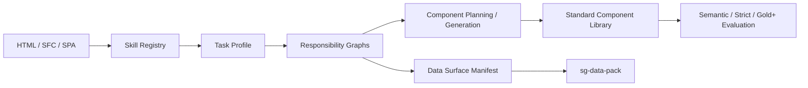

# ui-dismantler

> 将静态 HTML、SFC 和 SPA 拆解为可复用、可审查、可验证的标准前端组件库。

`ui-dismantler` 的目标不是复制页面截图，也不是为单个案例堆叠规则，而是建立一条可复现的组件生产链：

```text
原始页面 / 前端项目
    → 结构、组件、状态、交互、路由与 API 责任分析
    → 组件规划与标准组件候选生成
    → Semantic / Strict / runtime / visual 质量验证
    → 可复用组件库与数据接口合同
```

当前项目已经具备组件拆解、规划、候选生成和 Gold+ 验证能力；现阶段重点是稳定端到端组件库生产闭环，新的 Skill 只在出现可复现的通用缺口后增量加入。

## 项目边界

### `ui-dismantler` 负责

- HTML、DOM、CSS、资源和响应式结构分析；
- Vue SFC 组件、slot、状态、交互和视觉责任分析；
- SPA 路由、认证守卫、代理和 API 消费边界分析；
- 组件规划、组件候选生成和组件库质量验证；
- 输出 Data Surface Manifest，描述组件需要的数据形状、字段、消费者和注入边界。

### `ui-dismantler` 不负责

- 业务实体标准化；
- aliases、relations、stages、contents 等领域数据建模；
- Data Pack 和数据适配器生成；
- 将静态 HTML 中的业务记录直接复制到组件合同。

上述数据层能力由独立项目 `sg-data-pack` 负责。Data Surface Manifest 是两个项目之间的接口合同，不是业务数据包。详见 [`docs/architecture/data-boundary.md`](docs/architecture/data-boundary.md)。

## 架构


```mermaid
flowchart LR
  A["HTML / SFC / SPA"] --> B["Skill Registry"]
  B --> C["Task Profile"]
  C --> D["Responsibility Graphs"]
  D --> E["Component Planning / Generation"]
  E --> F["Standard Component Library"]
  F --> G["Semantic / Strict / Gold+ Evaluation"]
  D --> H["Data Surface Manifest"]
  H --> I["sg-data-pack"]
```

### Core

Core 只负责稳定、通用的运行基础设施：

```text
src-ts/core/
├── skills/          Skill 合同、注册、依赖解析和执行证据
├── profiles/        Task Profile、执行计划和执行器
├── artifacts/       Skill 输出、reviewed binding 和运行产物根目录
└── responsibility/  统一责任图增量与冲突阻断
```

### Skill

每个 Skill 声明统一的 `SkillManifest`：

```text
id
version
contractVersion
kind
summary
stages
consumes / optionalConsumes
produces
requires / optionalDependencies
qualityGates
sideEffects
```

Skill 必须满足：

- 使用小写 kebab-case ID；
- 显式声明输入、输出和依赖；
- 原始算法输出保持不变；
- execution evidence 与 raw output 分离；
- unresolved 证据不能静默升级为已证明责任；
- 案例名、组件名、函数名和可见文本不得成为泛化规则白名单。

### Task Profile

Profile 将多个 Skill 组合为一种拆解任务：

| Profile | 用途 | 主要 Skill |
|---|---|---|
| `source-page` | 静态页面结构与可选状态分析 | `source-structure`、可选 `state-responsibility` |
| `spa-application` | SPA 路由、状态与可选认证分析 | `source-structure`、`state-responsibility`、`spa-router` |
| `data-backed-spa` | 带 API 和组件数据接口的 SPA | component、proxy、API、cardinality、Data Surface |
| `component-library` | 已生成组件库的规范与数据边界验证 | `component-library-validation` |
| `primitive-dom` | 将 reviewed SFC 组件结构编译为可追溯 Primitive DOM 候选 | `component-ownership`、`primitive-dom` |

Profile 只有在完整执行计划通过 reviewed input 检查后才会运行。

### 组件库生产流水线

当前组件库生产主链使用独立的 `ComponentLibraryBuildPlan`，将既有组件规划、生成文件、样式、交互和证据统一交给物化器，再进入 Runtime Smoke、静态验证和可选 Gold+：

```text
ComponentLibraryBuildPlan
  → Materializer
  → Runtime Smoke
  → component-library-validation
  → Roundtrip / Gold+
  → ComponentLibraryBuildReport
```

先从配置生成确定性 Build Plan：

```bash
node dist-ts/cli.js component-build-plan \
  /absolute/path/to/component-build.config.json \
  --out /tmp/component-library.build-plan.json
```

再执行物化、冒烟和组件库验证：

```bash
node dist-ts/cli.js component-build \
  /tmp/component-library.build-plan.json \
  --out-dir /tmp/generated-component-library \
  --report /tmp/component-library.build-report.json
```

Build Plan 要求所有发布文件带有 provenance；fixture 和 examples 可以写入构建目录，但不能标记为 publishable。`Runtime Smoke` 在浏览器质量门之前检查模块加载、`mount()`、首屏节点、运行时错误、本地资源、外部 adapter readiness 和可选清理合同。

当 reviewed artifacts 已经准备好时，可以用一个配置直接运行完整生产链，而不再手工串联 plan、enrich 和 build：

```json
{
  "schemaVersion": "1.0",
  "sourceRoot": "./source",
  "library": {
    "name": "Reviewed Components",
    "packageName": "reviewed-components"
  },
  "artifacts": {
    "primitiveDom": "./artifacts/primitive-dom.graph.json",
    "stateMap": "./artifacts/component-state.map.json",
    "style": "./artifacts/reviewed-component-style.artifact.json",
    "dataSurface": "./artifacts/data-surface.manifest.json",
    "runtimeOptions": "./artifacts/runtime-options.json"
  }
}
```

SFC responsibility graph 中的 state 和 compiled styles 先生成 review-only candidate；候选中的每个 owner/entry 必须有人审查，不能由命令自动标记为 reviewed：

```bash
node dist-ts/cli.js component-state-candidate \
  /absolute/path/to/sfc-visual.graph.json \
  --primitive-dom /absolute/path/to/primitive-dom.graph.json \
  --out /tmp/component-state.map.json

node dist-ts/cli.js component-style-candidate \
  /absolute/path/to/sfc-visual.graph.json \
  --primitive-dom /absolute/path/to/primitive-dom.graph.json \
  --out /tmp/reviewed-component-style.artifact.json
```

```bash
node dist-ts/cli.js component-produce \
  /absolute/path/to/component-production.config.json \
  --out-dir /tmp/generated-component-library \
  --plan /tmp/component-library.build-plan.json \
  --report /tmp/component-library.build-report.json \
  --result /tmp/component-library.production-result.json
```

`component-produce` 只编排 reviewed artifacts：它不重新分析源项目、不猜测 DOM，也不把 orchestration 伪装成新的 Skill。任一 artifact 仍需 review、adapter 缺失或质量门失败时，统一结果会保持 blocked/failed。

该流水线当前首先标准化已有生成结果和 reviewed 文件。已有中间结果可以通过显式 adapter 投影：

```bash
node dist-ts/cli.js primitive-dom-build-plan \
  /absolute/path/to/primitive-dom.graph.json \
  --source-root /absolute/path/to/source \
  --name "Reviewed Components" \
  --package-name reviewed-components \
  --quality-html /absolute/path/to/original.html \
  --quality-scenarios /absolute/path/to/scenarios.json \
  --out /tmp/primitive-dom.build-plan.json
```

`component-plan-build-plan` 也可以生成一个 review-gated 计划；当 `ComponentPlanningReport` 没有可执行 DOM 拓扑或样式物化证据时，命令会明确阻断，而不是生成空壳组件。`visual-target-build-plan` 会消费旧 `VisualTargetPlan` 和 scoped source styles，但由于 Visual Target 本身是 review-only、`generatedCode: false`，生成的 Build Plan 仍然保持阻断状态。后续可以用 `component-build-enrich` 追加 reviewed State Responsibility 与 Data Surface 证据：

```bash
node dist-ts/cli.js component-build-enrich \
  /tmp/component-library.build-plan.json \
  --state /tmp/sfc-state.json \
  --data-surface /tmp/data-surface.manifest.json \
  --primitive-dom /tmp/primitive-dom.graph.json \
  --runtime-options /tmp/component-runtime-options.json \
  --out /tmp/component-library.reviewed-build-plan.json
```

单组件可以继续使用 `--state`。多组件 Build Plan 必须改用 `--state-map`，以 `componentId` 明确绑定每个 `SfcStateResponsibility`；同名 handler 和相同 state path 不会跨 owner 共享。未限定 owner 的 state evidence 在多组件计划中会保持阻断。

```json
{
  "schemaVersion": "1.0",
  "kind": "component-state-evidence-map",
  "entries": [
    {
      "ownerId": "component:alpha",
      "responsibility": {},
      "reviewed": true,
      "evidence": ["reviewed SFC state ownership"]
    }
  ],
  "unresolved": [],
  "reviewRequired": false
}
```

Source style 通过独立 `reviewed-component-style-artifact` 交接。owner 样式会自动限定到生成组件的 `[data-component-id]` 边界，显式 global 样式保持全局；CSS 语法、Primitive graph hash、owner identity、evidence 和 review state 任一不成立都会阻断生产。这样完整 SFC CSS 不再依赖页面级手写字符串，也不会泄漏到其他生成组件。

当 Data Surface 是 reviewed component-prop 且 Primitive DOM 提供了可解析、与组件 owner 对齐的 `v-for` 证据时，集合可以通过 `mount(..., { data })` 重复物化。reviewed API Data Surface 不会把 endpoint、fixture 或业务值写进发布运行时，而是生成以 surface id 为 `adapterKey` 的外部 adapter contract；`sg-data-pack` 或调用方通过 `mount(..., { adapters })` / `--runtime-options` 提供经过规范化的数据。缺少 adapter、adapter 抛错、shape/cardinality/field 不匹配都会在 Runtime Smoke 中失败。静态业务 binding、未知 runtime binding 和 unresolved collection 仍然阻断。`v-if`/`v-show` 仅在 Primitive graph identity 一致、条件表达式属于受限语法、依赖路径存在于 reviewed initial state 时解除阻断；`v-model` 也必须绑定到 reviewed initial state，运行时才会执行输入状态更新、依赖 DOM 重渲染和焦点恢复。`v-else`/`v-else-if`、`v-model` modifiers、函数调用和未知表达式继续 fail-closed。经审核的 state transition 可在运行时触发重新渲染，并通过 `--quality-html`、`--quality-scenarios` 和可选 `--quality-visual` 接入现有 Quality Gate。业务数据值仍不会写入 publishable runtime。后续再将旧 visual target generator 投影为同一个 Build Plan，不新增案例专用生成规则。

## 当前内置 Skill

| Skill | 责任 |
|---|---|
| `source-structure` | HTML 基础结构、主题、交互和资源事实 |
| `state-responsibility` | SFC state、handler 和 state-write 责任 |
| `spa-router` | SPA Semantic/Strict 路由合同与导航验证 |
| `auth-guard` | storage、token、登录、路由守卫和认证责任 |
| `component-ownership` | SFC 组件、模板、样式和视觉 ownership |
| `component-library-validation` | 已生成组件库的命名、数据分离、响应式、A11y、主题、依赖、文档和类名合同 |
| `primitive-dom` | SFC 模板到 Primitive DOM、样式规则和交互绑定的 provenance-preserving 编译 |
| `transport-proxy` | Vite/Webpack proxy、prefix、target 和 rewrite 证据 |
| `api-responsibility` | API wrapper、endpoint、response consumer 和 fixture 边界 |
| `data-cardinality` | 组件集合基数、slice 和重复区域证据 |
| `data-surface-manifest` | 组件数据接口合同，不生成 Data Pack |

Skill Kernel 设计详见 [`docs/architecture/skill-kernel.md`](docs/architecture/skill-kernel.md)。

## 安装与构建

```bash
npm install
npm run typecheck:ts
npm run build:ts
```

项目仍保留 Python 兼容工具链；使用旧分析和往返脚本时安装：

```bash
pip install --user beautifulsoup4
```

## 标准 CLI

统一 CLI 入口：

```bash
node dist-ts/cli.js <command>
```

### Skill 发现与执行

```bash
# 查看全部已注册 Skill
node dist-ts/cli.js skill-list
node dist-ts/cli.js skill-list --out /tmp/skill-catalog.json

# 直接运行单个 Skill；output 与 evidence 分离
node dist-ts/cli.js skill-run source-structure \
  --input /tmp/source-structure.input.json \
  --out /tmp/source-manifest.json \
  --evidence-out /tmp/source-structure.evidence.json
```

`source-structure.input.json` 示例：

```json
{
  "htmlPath": "/absolute/path/to/page.html",
  "options": {
    "minimal": true
  }
}
```

`skill-run` 是单能力调试入口，不会自动执行依赖 Skill。正式多能力任务应使用 Profile。

### Profile 发现、计划与执行

```bash
node dist-ts/cli.js profile-list
node dist-ts/cli.js profile-list --out /tmp/profile-catalog.json

node dist-ts/cli.js profile-plan /tmp/profile.config.json \
  --out /tmp/profile.plan.json

node dist-ts/cli.js profile-run /tmp/profile.config.json \
  --out /tmp/profile.report.json
```

Profile 配置示例：

```json
{
  "schemaVersion": "1.0",
  "profileId": "source-page",
  "enabledOptionalSkills": [],
  "inputProviders": [
    {
      "contract": "html-path",
      "providerId": "reviewed-source",
      "reviewed": true,
      "inputPath": "htmlPath",
      "value": "/absolute/path/to/page.html"
    }
  ]
}
```

组件库 Profile 的最小配置：

```json
{
  "schemaVersion": "1.0",
  "profileId": "component-library",
  "enabledOptionalSkills": [],
  "inputProviders": [
    {
      "contract": "component-library-root",
      "providerId": "reviewed-library",
      "reviewed": true,
      "inputPath": "libraryRoot",
      "value": "/absolute/path/to/component-library"
    }
  ]
}
```

Profile 报告分别保留：

```text
raw output
SkillExecutionEvidence
artifact references
ResponsibilityGraphDelta
blockers
quality gates
```

### 组件拆解与质量命令

现有命令保持兼容，不因 Skill Kernel 接入而改变参数、输出或退出码：

```bash
# HTML → manifest
node dist-ts/cli.js analyze <page.html> --out /tmp/manifest.json --minimal

# manifest evidence → 组件计划与组件规格
node dist-ts/cli.js plan <page.html> \
  --out /tmp/component-plan.json \
  --spec-dir /tmp/component-specs

# 组件库静态验证
node dist-ts/cli.js validate <component-lib-dir>

# 原页面与组件库往返验证
node dist-ts/cli.js roundtrip <page.html> --lib <component-lib-dir> \
  --out /tmp/roundtrip-report.json

# Gold+ 浏览器质量验证
node dist-ts/cli.js quality <page.html> --lib <component-lib-dir> \
  --visual-artifacts /tmp/ui-dismantler-visual \
  --out /tmp/quality-report.json

# 通过 Skill Registry 验证已生成的组件库（raw output 与 evidence 分离）
node dist-ts/cli.js skill-run component-library-validation \
  --input /tmp/component-library.input.json \
  --out /tmp/component-library.validation.json \
  --evidence-out /tmp/component-library.validation.evidence.json

# 通过 component-library Profile 执行 reviewed 组件库验证
node dist-ts/cli.js profile-run /tmp/component-library.profile.json \
  --out /tmp/component-library.profile.report.json

# 通过 primitive-dom Skill 编译 reviewed 组件责任图中的模板结构
node dist-ts/cli.js skill-run primitive-dom \
  --input /tmp/primitive-dom.input.json \
  --out /tmp/primitive-dom.compilation.json \
  --evidence-out /tmp/primitive-dom.compilation.evidence.json
```

项目级责任图仍可独立生成，例如：

```bash
node dist-ts/cli.js sfc-visual-analyze /absolute/project-root \
  --out /tmp/sfc-visual.graph.json

node dist-ts/cli.js transport-proxy-analyze /absolute/project-root \
  --out /tmp/transport-proxy.graph.json

node dist-ts/cli.js spa-auth-analyze /absolute/project-root \
  --out /tmp/spa-auth.graph.json
```

### CLI 约定

- 命令和 ID 使用 kebab-case；
- JSON 输入使用 `--input` 或显式配置文件；
- 正式 JSON 结果使用 `--out`；
- execution evidence 使用独立 `--evidence-out`，不包装或改变 raw output；
- `0` 表示成功，`1` 表示质量失败或 reviewed plan 被阻断，`2` 表示参数或执行错误；
- 旧命令继续保持兼容，新能力优先通过 `skill-*` 和 `profile-*` 入口暴露。

## 组件库产出标准

标准产物至少包括：

```text
<library>/
├── README.md
├── docs/
├── src/
│   ├── components/
│   ├── styles/
│   └── index.*
├── examples/
├── data-surface.manifest.json
├── component-plan.json
├── component-specs/
└── quality-summary.json
```

具体文件形态可以随目标框架变化，但必须保持：

- 组件边界有结构证据；
- 样式使用可复用 token 和响应式规则；
- 交互、状态和生命周期可验证；
- 数据接口与业务数据内容分离；
- reference/generated 使用独立运行上下文；
- unresolved 与 review 状态可审计；真正 blocker 与 policy notice 分开保存。

## 质量门禁

质量体系包含：

```text
静态组件库约束
DOM / 文本往返等价
Semantic route contract
Strict route contract
navigation integrity
computed style
reviewed-region pixel diff
runtime / network / resource stability
Canvas stability
blocking handles
```

分层回归：

```bash
# PR：类型检查、构建、单元测试和冻结证据
npm run test:pr

# 合并前：完整关键场景与浏览器 Gold+
UI_DISMANTLER_VUE_ELEMENT_ADMIN_SOURCE=/absolute/path/to/vue-element-admin \
  npm run test:gold

# Nightly：PR + Gold+ + 多轮性能基线
UI_DISMANTLER_VUE_ELEMENT_ADMIN_SOURCE=/absolute/path/to/vue-element-admin \
  npm run test:nightly
```

正式回归不会通过降低像素、稳定性、网络、字体、生命周期或 BrowserContext 隔离要求换取速度。运行截图和原始性能报告默认写入系统临时目录或 `UI_DISMANTLER_ARTIFACT_ROOT`，避免污染案例源目录。

## Python 兼容工具

旧工具链继续保留用于历史案例和兼容验证：

| 工具 | 用途 |
|---|---|
| `src/skill/scripts/analyze_html.py` | HTML → 兼容 manifest |
| `src/skill/scripts/validate_lib.py` | 组件库静态约束校验 |
| `scripts/roundtrip.py` | 原页面与组件库往返等价 |
| `scripts/generate_scenarios.py` | 生成待审阅交互场景候选 |
| `scripts/verify_all.py` | 批量历史回归 |

旧脚本中的数据契约扫描仅提供组件接口分析线索，不承担业务数据规范化或 Data Pack 生成。

## 目录

```text
src-ts/
├── core/          Skill Kernel、Profile、Artifact 和责任图基础设施
├── skills/        可组合的拆解能力
├── profiles/      默认 Task Profile 和 reviewed bindings
├── planning/      组件、路由、视觉和生成规划算法
├── evaluation/    Semantic、Strict、Gold+ 和浏览器质量验证
└── tests/         单元、集成和冻结回归

src/skill/         Python/ZCode 兼容 Skill 与脚本
benchmark/         通用历史 benchmark
examples/          冻结案例及其正式配置；运行产物不应写入此目录
docs/              架构、协议、基线和研究记录
scripts/           回归、转译和质量运行脚本
```

## 开发原则

1. 先证明责任，再生成组件；
2. 先运行未经人工修复的 baseline，再决定算法缺口；
3. 案例只作为验证证据，不进入通用规则；
4. 不使用截图硬猜 DOM，不用可见文本替代 ownership；
5. 不降低 Gold+、Strict、runtime、network 或 stability 门禁；
6. 一个 Skill 一套清晰合同、依赖、证据和测试；
7. 先稳定组件库生产主链，后续再按通用缺口增加 Skill。

## 更多文档

- [`docs/architecture/skill-kernel.md`](docs/architecture/skill-kernel.md)
- [`docs/architecture/data-boundary.md`](docs/architecture/data-boundary.md)
- [`docs/TYPESCRIPT_MIGRATION.md`](docs/TYPESCRIPT_MIGRATION.md)
- [`docs/ROADMAP.md`](docs/ROADMAP.md)
- [`src/skill/SKILL.md`](src/skill/SKILL.md)
