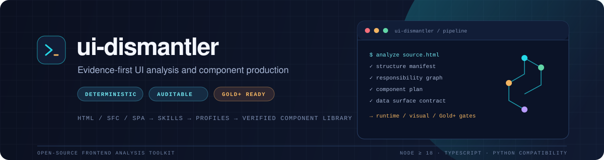
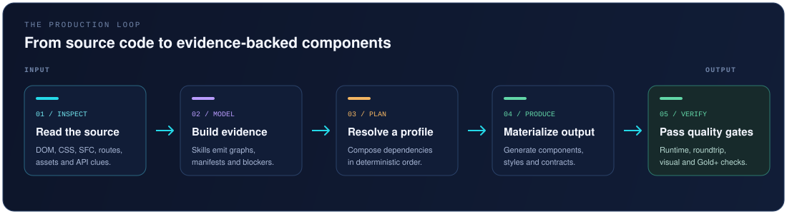
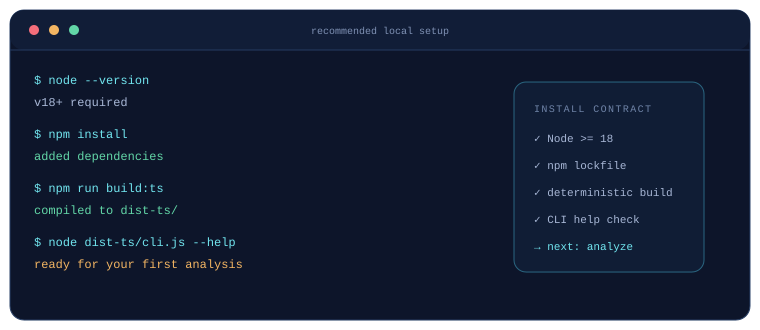
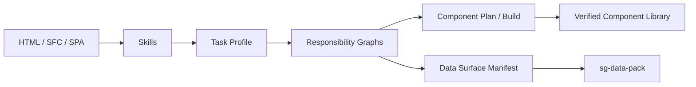
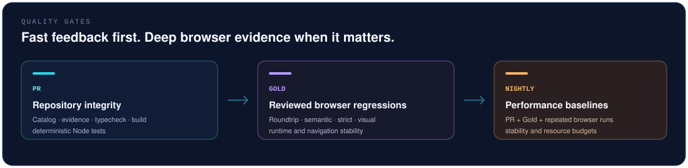

<div align="center">
  

  <p><strong>English</strong> · <a href="README.zh-CN.md">简体中文</a></p>

  <p>
    
    
    
  </p>

  <strong>Turn HTML, Vue SFCs, and SPAs into reusable, reviewable, and verifiable component-library artifacts.</strong>
</div>

`ui-dismantler` is an evidence-first frontend analysis and production toolkit. It models structure, state, interaction, routes, APIs, and data boundaries before producing components, then validates the result through deterministic quality gates.

## Why ui-dismantler?

<table>
<tr>
<td width="33%">

### 🧭 Evidence-first

Responsibilities, dependencies, blockers, and outputs remain explicit and auditable.

</td>
<td width="33%">

### 🧩 Composable

Skills handle focused capabilities; Task Profiles compose them into reviewable workflows.

</td>
<td width="33%">

### 🛡️ Verifiable

Static, runtime, roundtrip, route, visual, and Gold+ checks protect generated output.

</td>
</tr>
</table>

## How it works



```text
HTML / SFC / SPA
  → inspect structure and responsibilities
  → build evidence and resolve a Task Profile
  → plan and materialize reusable components
  → verify runtime, semantic, visual, and stability quality
```

## Installation



The package is currently marked as private, so install it from source:

```bash
git clone https://github.com/SuTang-vain/ui-dismantler.git
cd ui-dismantler

npm install
npm run build:ts
node dist-ts/cli.js --help
```

Requirements:

- Node.js 18 or newer;
- npm;
- Python 3 and `beautifulsoup4` only for legacy compatibility tools.

For CI, prefer the lockfile-exact installation:

```bash
npm ci
npm run test:pr
```

## Quick start

Discover the available Skills and Profiles:

```bash
node dist-ts/cli.js skill-list
node dist-ts/cli.js profile-list
```

Analyze a page and create a component plan:

```bash
node dist-ts/cli.js analyze ./page.html \
  --out /tmp/ui-dismantler/manifest.json \
  --minimal

node dist-ts/cli.js plan ./page.html \
  --out /tmp/ui-dismantler/component-plan.json \
  --spec-dir /tmp/ui-dismantler/component-specs
```

Validate a generated component library:

```bash
node dist-ts/cli.js validate /absolute/path/to/component-library
```

Build a reviewed component-library plan:

```bash
node dist-ts/cli.js component-build-plan \
  /absolute/path/to/component-build.config.json \
  --out /tmp/component-library.build-plan.json

node dist-ts/cli.js component-build \
  /tmp/component-library.build-plan.json \
  --out-dir /tmp/generated-component-library \
  --report /tmp/component-library.build-report.json
```

Run `node dist-ts/cli.js --help` for the full CLI reference.

## Architecture


```mermaid
flowchart LR
  A["HTML / SFC / SPA"] --> B["Skills"]
  B --> C["Task Profile"]
  C --> D["Responsibility Graphs"]
  D --> E["Component Plan / Build"]
  E --> F["Verified Component Library"]
  D --> G["Data Surface Manifest"]
  G --> H["sg-data-pack"]
```

| Layer | Responsibility |
|---|---|
| Core | Skill contracts, Profiles, artifacts, execution evidence, and responsibility graphs |
| Skills | Source, state, component, route, API, lifecycle, data-surface, and visual capabilities |
| Planning | Component, SPA shell, route, visual-target, and build planning |
| Production | Reviewed component-library materialization and runtime smoke checks |
| Evaluation | Semantic, Strict, roundtrip, visual, browser, network, and stability gates |

### Project boundary

`ui-dismantler` owns component analysis, planning, production, validation, and the **Data Surface Manifest** contract. It does not normalize business entities or generate Data Packs; those responsibilities belong to `sg-data-pack`.

See [`docs/architecture/data-boundary.md`](docs/architecture/data-boundary.md) for the complete boundary.

## CLI map

| Area | Main commands |
|---|---|
| Discover | `skill-list`, `profile-list` |
| Execute | `skill-run`, `profile-plan`, `profile-run` |
| Analyze | `analyze`, `plan`, `sfc-visual-analyze`, `spa-vue-router-analyze` |
| SPA and data | `spa-router`, `spa-auth-analyze`, `transport-proxy-analyze`, `data-surface` |
| Produce | `component-build-plan`, `component-build-enrich`, `component-build`, `component-produce` |
| Verify | `validate`, `roundtrip`, `quality` |

CLI outputs keep raw results, execution evidence, artifacts, blockers, and quality gates separate. Generated screenshots and reports should go to the system temporary directory or `UI_DISMANTLER_ARTIFACT_ROOT`, not managed source cases.

## Quality gates



```bash
# Pull-request tier
npm run test:pr

# Reviewed browser regressions
npm run test:gold

# PR + Gold + performance baselines
npm run test:nightly
```

Additional development commands:

```bash
npm run catalog:validate
npm run evidence:audit
npm run typecheck:ts
npm run build:ts
npm run test:all
npm run verify:component-boundary
```

Do not lower Strict, Gold, runtime, network, visual, or stability gates to make a case pass.

## Repository map

```text
src-ts/core/        Skill Kernel, Profiles, artifacts, and responsibility infrastructure
src-ts/skills/      composable analysis capabilities
src-ts/planning/    component, route, visual, and generation planning
src-ts/production/  component-library materialization
src-ts/evaluation/  browser and quality evaluation
src-ts/validation/  component-library validation
src-ts/tests/       unit, integration, and frozen regressions

cases/              managed case catalog
benchmarks/         PR, Gold, and Nightly protocols
evidence/           reviewed evidence retention and budgets
docs/               architecture and project documentation
scripts/            verification and regression tooling
```

## Documentation

- [Skill Kernel](docs/architecture/skill-kernel.md)
- [Data boundary](docs/architecture/data-boundary.md)
- [Generic analysis rules](docs/architecture/generic-analysis.md)
- [Repository governance](docs/architecture/repository-governance.md)
- [TypeScript migration](docs/TYPESCRIPT_MIGRATION.md)
- [Roadmap](docs/ROADMAP.md)
- [Cases](cases/README.md) · [Benchmarks](benchmarks/README.md) · [Evidence](evidence/README.md)

---

<div align="center">
  <strong>Analyze responsibilities. Produce reusable components. Verify the result.</strong>
  <br />
  <sub><a href="README.zh-CN.md">阅读简体中文文档</a></sub>
</div>
