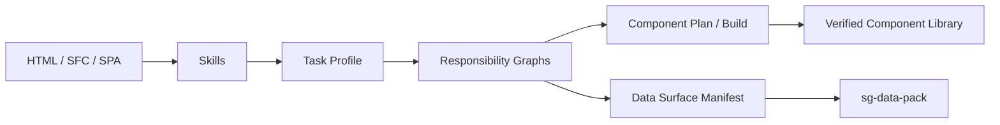

<div align="center">
  

  <p><a href="README.md">English</a> · <strong>简体中文</strong></p>

  <p>
    
    
    
  </p>

  <strong>将 HTML、Vue SFC 和 SPA 转换为可复用、可审查、可验证的组件库产物。</strong>
</div>

`ui-dismantler` 是一套证据优先的前端分析与组件生产工具。它先分析结构、状态、交互、路由、API 和数据边界，再规划并生成组件，最后通过确定性的质量门禁验证结果。

## 为什么使用 ui-dismantler？

<table>
<tr>
<td width="33%">

### 🧭 证据优先

责任、依赖、阻断项和输出均保持显式、可追溯和可审计。

</td>
<td width="33%">

### 🧩 可组合

Skill 提供单一能力，Task Profile 将它们组合成可审阅的工作流。

</td>
<td width="33%">

### 🛡️ 可验证

通过静态、运行时、往返、路由、视觉和 Gold+ 门禁保护生成结果。

</td>
</tr>
</table>

## 工作流程


```text
HTML / SFC / SPA
  → 分析结构与责任
  → 建立证据并解析 Task Profile
  → 规划和物化可复用组件
  → 验证运行时、语义、视觉与稳定性
```

## 安装


项目当前被标记为私有 npm 包，因此推荐从源码安装：

```bash
git clone https://github.com/SuTang-vain/ui-dismantler.git
cd ui-dismantler

npm install
npm run build:ts
node dist-ts/cli.js --help
```

环境要求：

- Node.js 18 或更高版本；
- npm；
- 仅在使用旧 Python 兼容工具时需要 Python 3 和 `beautifulsoup4`。

CI 环境推荐使用锁文件精确安装：

```bash
npm ci
npm run test:pr
```

## 快速开始

查看可用的 Skill 和 Profile：

```bash
node dist-ts/cli.js skill-list
node dist-ts/cli.js profile-list
```

分析页面并生成组件规划：

```bash
node dist-ts/cli.js analyze ./page.html \
  --out /tmp/ui-dismantler/manifest.json \
  --minimal

node dist-ts/cli.js plan ./page.html \
  --out /tmp/ui-dismantler/component-plan.json \
  --spec-dir /tmp/ui-dismantler/component-specs
```

验证已经生成的组件库：

```bash
node dist-ts/cli.js validate /absolute/path/to/component-library
```

执行 reviewed 组件库构建：

```bash
node dist-ts/cli.js component-build-plan \
  /absolute/path/to/component-build.config.json \
  --out /tmp/component-library.build-plan.json

node dist-ts/cli.js component-build \
  /tmp/component-library.build-plan.json \
  --out-dir /tmp/generated-component-library \
  --report /tmp/component-library.build-report.json
```

运行 `node dist-ts/cli.js --help` 查看完整命令和参数。

## 架构



| 层级 | 责任 |
|---|---|
| Core | Skill 合同、Profile、Artifact、执行证据和责任图 |
| Skills | 源码、状态、组件、路由、API、生命周期、数据接口和视觉能力 |
| Planning | 组件、SPA Shell、路由、视觉目标和构建规划 |
| Production | reviewed 组件库物化和 Runtime Smoke |
| Evaluation | Semantic、Strict、往返、视觉、网络和稳定性验证 |

### 项目边界

`ui-dismantler` 负责组件分析、规划、生产、验证和 **Data Surface Manifest** 合同，不负责业务实体标准化或 Data Pack 生成；相关数据层能力属于 `sg-data-pack`。

完整边界参见 [`docs/architecture/data-boundary.md`](docs/architecture/data-boundary.md)。

## CLI 导航

| 范围 | 主要命令 |
|---|---|
| 发现 | `skill-list`、`profile-list` |
| 执行 | `skill-run`、`profile-plan`、`profile-run` |
| 分析 | `analyze`、`plan`、`sfc-visual-analyze`、`spa-vue-router-analyze` |
| SPA 与数据 | `spa-router`、`spa-auth-analyze`、`transport-proxy-analyze`、`data-surface` |
| 生产 | `component-build-plan`、`component-build-enrich`、`component-build`、`component-produce` |
| 验证 | `validate`、`roundtrip`、`quality` |

CLI 会分别保存原始输出、执行证据、Artifact、阻断项和质量门禁结果。截图和运行报告应写入系统临时目录或 `UI_DISMANTLER_ARTIFACT_ROOT`，不要写入受管理的源案例。

## 质量门禁


```bash
# PR 质量等级
npm run test:pr

# Reviewed 浏览器 Gold 回归
npm run test:gold

# PR + Gold + 性能基线
npm run test:nightly
```

常用开发命令：

```bash
npm run catalog:validate
npm run evidence:audit
npm run typecheck:ts
npm run build:ts
npm run test:all
npm run verify:component-boundary
```

不得通过降低 Strict、Gold、运行时、网络、视觉或稳定性门禁让案例通过。

## 仓库目录

```text
src-ts/core/        Skill Kernel、Profile、Artifact 和责任基础设施
src-ts/skills/      可组合分析能力
src-ts/planning/    组件、路由、视觉和生成规划
src-ts/production/  组件库物化
src-ts/evaluation/  浏览器和质量验证
src-ts/validation/  组件库验证
src-ts/tests/       单元、集成和冻结回归

cases/              受管理的案例 Catalog
benchmarks/         PR、Gold 和 Nightly 协议
evidence/           reviewed evidence 保留策略和预算
docs/               架构和项目文档
scripts/            验证与回归工具
```

## 文档

- [Skill Kernel](docs/architecture/skill-kernel.md)
- [数据边界](docs/architecture/data-boundary.md)
- [通用分析规则](docs/architecture/generic-analysis.md)
- [仓库治理](docs/architecture/repository-governance.md)
- [TypeScript 迁移](docs/TYPESCRIPT_MIGRATION.md)
- [路线图](docs/ROADMAP.md)
- [案例](cases/README.md) · [Benchmark](benchmarks/README.md) · [Evidence](evidence/README.md)

---

<div align="center">
  <strong>分析责任，生产可复用组件，验证最终结果。</strong>
  <br />
  <sub><a href="README.md">Read in English</a></sub>
</div>
