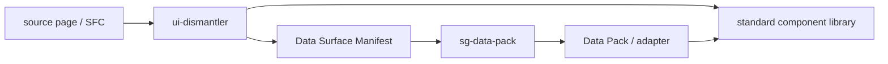

# Component data boundary

## Purpose

`ui-dismantler` is responsible for producing and validating reusable frontend components. It may identify the **data surface** that a component requires so that another system can provide data deterministically, but it does not model or normalize business entities.

`sg-data-pack` is the independent data-layer project. It consumes a reviewed Data Surface Manifest and owns business-data normalization and pack generation.

## Allowed output in `ui-dismantler`

A Data Surface Manifest can contain:

- source identity and frozen hashes;
- API or reviewed fixture references;
- collection/object shape and cardinality evidence;
- field paths and component consumers;
- injection boundaries and cross-surface references;
- unresolved evidence and review state.

The manifest is an interface description, not a business-data payload.

## Explicitly out of scope

The following must not be added to `ui-dismantler` Skills, Core contracts, or generated targets:

- extraction of embedded business records for normalization;
- entity schemas, aliases, relations, stages, or contents;
- domain-specific semantic classification;
- Data Pack generation or Data Pack adapters;
- raw static business values copied into a deliverable manifest.

The validator rejects the reserved Data Pack keys (`entities`, `aliases`, `relations`, `stages`, `contents`, and `adapters`) and rejects raw static values in a Data Surface source.

## Profile execution boundary

The generic `profile-plan` and `profile-run` commands execute reviewed Skill chains. A profile provider supplies source paths, configuration, or reviewed graph artifacts; it does not turn business data into a Core input contract. A downstream data project may consume the resulting manifest through its own importer.

A case such as `/Users/tangyaoyue/Downloads/黄芪0529` is valid here as a static-interactive dismantling case for structure, interaction, responsive behavior, assets, and complexity. Its domain records remain an independent `sg-data-pack` concern.
