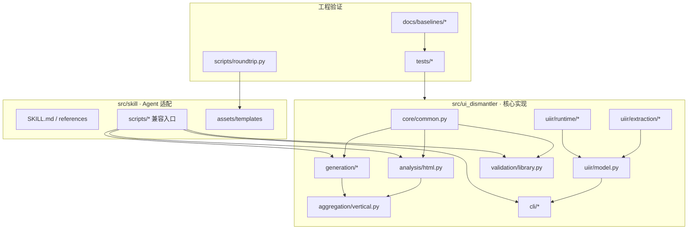

# 项目架构

## 1. 设计目标

当前结构遵循四个原则：

1. **实现与入口分离**：真实逻辑位于可导入的 Python 包，CLI 只负责参数和兼容。
2. **确定性与生成式职责分离**：工具提取事实并校验，Agent 负责语义判断和组件设计。
3. **静态分析优先，运行时证据增强**：缺少浏览器时仍能完成基础转换。
4. **测试资产与产品文档分层**：测试夹具、质量基线和架构设计各自独立。

## 2. 模块边界



### 核心包

| 模块 | 职责 | 不应承担 |
|---|---|---|
| `core/` | CSS、颜色、变量、数据契约等共享纯函数 | CLI 参数、文件产出流程 |
| `analysis/` | HTML/CSS/JS -> manifest v1 | UI-IR 投影、组件库生成 |
| `uiir/extraction/` | CSS `@media`、源码引用与本地资源证据 | 节点/关系业务建模、浏览器启动 |
| `uiir/runtime/` | Playwright 驱动的运行时场景执行（事件注册、候选盘点、状态转移、断言） | 静态证据抽取、节点/关系业务建模 |
| `uiir/model.py` | UI-IR 建模、验证、反向转换和观察投影 | 浏览器启动细节 |
| `generation/` | 组件库脚手架、showcase、输出适配 | 源页面关系推断 |
| `validation/` | 组件库强约束检查 | 自动修复 |
| `aggregation/` | 多案例 manifest 聚合 | 单页分析实现 |
| `cli/` | 参数解析、读写文件、退出码 | 核心算法 |

## 3. 兼容策略

`src/skill/scripts/*.py` 保留为兼容层，确保既有命令无需修改。兼容脚本通过 `_bootstrap.py` 加载 `src/ui_dismantler`，自身不保存业务逻辑。

变更规则：

- 新算法写入 `src/ui_dismantler/`。
- 新 CLI 的 `main()` 写入 `src/ui_dismantler/cli/`。
- 若 Skill 需要稳定旧路径，再增加薄包装脚本。
- 测试直接导入核心包，不测试包装层内部实现；包装层通过 CLI smoke test 验证。

## 4. 数据流

```text
HTML/CSS/JS
  -> manifest v1
  -> canonical UI-IR v2
      -> compact observation（有损，供快速理解）
      -> expanded observation（可读调试）
      -> stable-key diff（变更分析）
      -> manifest v1（兼容回写）

manifest + Agent 语义理解
  -> 组件库 src/examples/docs/showcase
  -> validate + node --check + roundtrip
  -> 质量报告与修订
```

## 5. 依赖方向

允许：

- `analysis/generation/validation -> core`
- `uiir/model -> uiir/extraction + uiir/runtime`
- `aggregation -> analysis + generation + core`
- `cli -> 对应核心模块`
- `skill/scripts -> src/ui_dismantler`

禁止：

- 核心包反向导入 `src/skill/scripts`。
- 测试通过修改 `sys.path` 指向兼容脚本目录。
- UI-IR 模型直接包含 Playwright 操作细节。
- CLI 中复制核心转换逻辑。

## 6. 可部署性说明

当前仓库仍以 Skill 和本地工具协作运行，兼容命令会自动加入仓库 `src/`。若后续发布独立 Python 包，需要进一步迁移模板资产并增加正式打包配置；在此之前不把仓库声明为可独立 wheel 安装的软件包。
