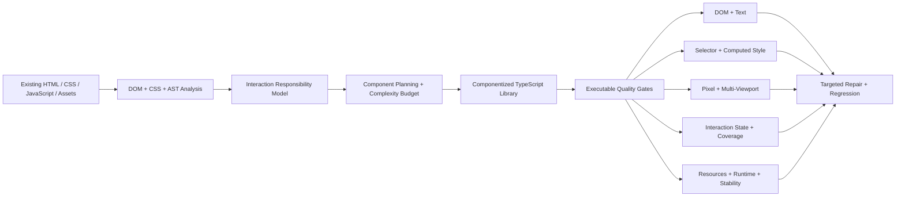

# 对外架构图与解释

## 主架构图



可单独渲染的 Mermaid 文件见 [`architecture.mmd`](./architecture.mmd)。

## 对外图注

**English**

> The system analyzes the existing implementation, assigns interaction responsibilities, plans component boundaries under a complexity budget, translates the page into a TypeScript library, and validates the result through real browser execution.

**中文**

> 系统先理解已有实现，建立交互责任和组件边界，再生成 TypeScript 组件库，并通过真实浏览器执行验证结构、样式、像素、交互、资源和稳定性。

## 建议突出显示的三个设计点

### 1. Responsibility-aware planning

不是把所有事件都当作用户场景：

```text
user-action
 gesture-protocol
 navigation-action
 no-op-control
 scroll/viewport/resource/custom lifecycle
```

### 2. Execution-grounded verification

不是只比较源代码或 DOM，而是让 reference/generated 真正运行，再比较：

```text
selector
computed style
pixel
interaction state
resource readiness
runtime error
stability
```

### 3. Cost-aware matrices

关键场景进入四视口视觉矩阵；协议型但不需要截图的正式场景只执行状态验证，避免无必要扩大浏览器成本。

## 不建议放入第一张图的内容

第一张公开图不要包含：

- 所有 TypeScript interface；
- 详细 timer/resource observer；
- 每个 validation 子项；
- 所有案例名称；
- 内部路径；
- 长段中文说明。

这些应放到后续 Thread 或技术说明。
