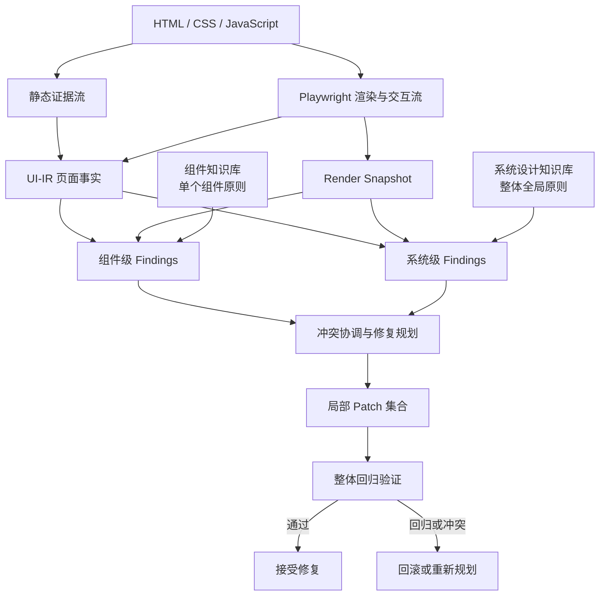

# DesignRepair 对 Ui_dismantler 的启发

> 文档状态：研究启发与架构建议<br>
> 整理日期：2026-07-19<br>
> 研究对象：*DesignRepair: Dual-Stream Design Guideline-Aware Frontend Repair with Large Language Models*

## 1. 文档目的

本文记录 DesignRepair 对 Ui_dismantler 下一阶段演进的启发，重点回答三个问题：

1. DesignRepair 中哪些方法与当前工具真正相关；
2. “组件知识库 + 系统设计知识库”的分而治之方式是否适合 Ui_dismantler；
3. 如何在不破坏现有 UI-IR、页面忠实度和测试体系的前提下落地。

本文不是对论文方案的直接复刻，也不意味着 Ui_dismantler 要变成通用的“页面美化工具”。当前工具的首要目标仍然是：

- 理解原页面的结构、数据、交互、状态和响应式行为；
- 生成可复用、可验证、尽可能保留原始设计意图的组件库；
- 将确定性提取与 Agent 的语义理解组合起来。

DesignRepair 提供的是一个可以叠加在现有能力之上的**质量理解与保守修复框架**。

---

## 2. 核心结论

“组件知识库『单个组件设计原则』+ 系统设计知识库『整体全局设计视角』”是非常合理的核心抽象，而且比单纯强调“双流分析”更接近 DesignRepair 的方法本质。

双流分析解决的是：

> 从哪里获得证据。

- 源代码流提供结构、选择器、数据绑定和代码位置；
- 渲染页面流提供真实尺寸、颜色、可见性、重叠、状态和用户可感知结果。

双层知识库解决的是：

> 应该从什么尺度理解和判断页面。

- 组件知识库判断一个按钮、Tab、Modal、输入框或卡片自身是否合理；
- 系统设计知识库判断多个组件组合后，页面整体是否协调、可用和一致。

但完整方法还需要第三层：

> 局部修复与全局约束之间的冲突协调和整体回归验证。

因此更完整的模型应是：

```text
局部组件原则
    +
全局系统原则
    +
整体协调与回归验证
```

可以将其概括为：

> **分而诊断，分层推理，合而修复，整体验证。**

---

## 3. 为什么必须同时保留局部和全局视角

### 3.1 只有组件知识库会导致“局部正确、整体失衡”

组件知识库适合判断：

- 按钮点击区域是否足够；
- 图标按钮是否有可访问名称；
- Tab 与 Panel 的 ARIA 关系是否正确；
- Modal 是否有关闭路径；
- 输入框是否有 Label；
- 卡片内容是否被自身边界裁切；
- 单个组件的状态反馈是否完整。

但单个组件的合理性不能保证页面整体合理。例如：

- 每个按钮都扩大到合格尺寸后，工具栏可能在移动端溢出；
- 每张卡片分别增加内边距后，整个网格可能变得拥挤；
- 每个标题单独提高字号后，页面的层级反而混乱；
- 每个组件单独提高对比度后，品牌色和视觉节奏可能被破坏；
- 每个 Modal 都合理，但多个浮层的 z-index 和关闭逻辑可能互相冲突。

因此组件知识库负责的是**局部合法性与局部可用性**，不能承担整体设计判断。

### 3.2 只有系统知识库会导致“宏观描述正确、修复无法定位”

系统知识库适合判断：

- 页面信息层级是否清晰；
- 色彩角色是否一致；
- 字体层级是否稳定；
- 间距是否形成统一节奏；
- 多个区域在不同断点下是否协调；
- 导航、内容和操作区域是否有合理优先级；
- 页面密度是否适合当前 viewport；
- 多个状态之间是否维持统一视觉语言。

但如果只有“页面间距不统一”“层级不清晰”这样的宏观判断，工具很难回答：

- 具体涉及哪些组件；
- 哪个 CSS 声明造成问题；
- 修改哪一个 token 风险最低；
- 应该修改组件局部样式，还是系统级设计令牌；
- 修复是否会影响其他实例。

因此系统知识库负责的是**全局一致性和跨组件关系**，最终仍需要回落到可定位的组件、元素、token 和源码片段。

### 3.3 两类知识之间是互补关系

| 维度 | 组件知识库 | 系统设计知识库 |
|---|---|---|
| 观察对象 | 单个组件及其内部元素 | 页面、区域、组件集合和设计令牌 |
| 典型范围 | Button、Tab、Modal、Card、Input | Color、Typography、Spacing、Layout、Elevation |
| 判断方式 | 组件类型 + 状态 + 属性 | 关系、分布、一致性、层级和全局约束 |
| 定位粒度 | 具体元素或组件实例 | 区域、组件组、token 或页面 |
| 修复方式 | 局部 HTML/CSS/JS Patch | token 调整、布局协调、跨组件修改 |
| 主要风险 | 局部修复引发全局回归 | 宏观建议过于主观或难以定位 |

---

## 4. 建议采用“三层知识与决策模型”

不建议只建立两个互相独立的知识文件。更合适的是建立三层模型。

### 4.1 第一层：组件知识库 Component Knowledge Base

描述单个组件在不同状态和上下文中的设计原则。

建议覆盖：

- 组件结构与必要子元素；
- 组件尺寸和点击目标；
- 组件状态：default、hover、focus、active、disabled、expanded；
- 键盘交互；
- ARIA 角色和属性关系；
- 内容边界与文本长度；
- 组件内部间距；
- 响应式降级方式；
- 硬约束与软建议；
- 可执行检测器和修复提示。

示例：

```json
{
  "id": "component.icon-button.accessible-name",
  "version": "1.0",
  "scope": "component",
  "componentTypes": ["icon-button"],
  "states": ["default", "disabled"],
  "constraint": "hard",
  "category": "label",
  "check": {
    "type": "accessible-name-present"
  },
  "repairHints": [
    "优先使用 aria-label",
    "若存在可见文本则使用 aria-labelledby"
  ]
}
```

### 4.2 第二层：系统设计知识库 System Design Knowledge Base

描述跨组件、跨区域和跨 viewport 的整体设计原则。

建议覆盖：

- 色彩角色和对比度体系；
- Typography 层级；
- 间距尺度与节奏；
- 网格、对齐和区域关系；
- 页面信息层级；
- 内容密度；
- 响应式重排策略；
- 导航与主要操作优先级；
- 高程、浮层和遮挡关系；
- 多组件状态一致性；
- 品牌设计意图保护。

示例：

```json
{
  "id": "system.spacing.sibling-consistency",
  "version": "1.0",
  "scope": "component-group",
  "constraint": "soft",
  "category": "spacing",
  "appliesWhen": {
    "relation": "siblings",
    "sameComponentType": true
  },
  "check": {
    "type": "spacing-consistency",
    "tolerancePx": 2
  },
  "repairStrategy": "优先调整共享 token，不逐个覆盖组件实例"
}
```

### 4.3 第三层：整体协调与修复策略 Repair Coordination Layer

这一层不是新的设计指南集合，而是对两类知识产生的 findings 和 patches 进行治理。

职责包括：

- 合并重复发现；
- 识别多个问题的共同根因；
- 判断应该修改组件实例、组件类还是设计 token；
- 检测修复之间的属性冲突；
- 确定修复顺序；
- 控制每轮修改范围；
- 在应用 Patch 后执行整体回归；
- 失败时回滚。

例如：

```text
发现 A：12 个按钮文字对比度不足
发现 B：8 个链接文字对比度不足
发现 C：次级文字在暗色背景下不可读

不推荐：分别修改 21 个选择器
推荐：识别共同根因 --sg-muted，并在验证影响范围后修改 token
```

又如：

```text
组件规则：按钮点击区域应扩大
系统规则：移动端工具栏不能横向溢出

协调结果：
1. 不直接增加工具栏总宽度；
2. 缩小按钮间距或改变工具栏布局；
3. 在窄屏使用两行或更多菜单；
4. 验证所有按钮仍满足点击目标要求。
```

---

## 5. 与当前 UI-IR 的关系

现有 UI-IR 已经可以为两类知识库提供目标定位。

### 5.1 组件知识库主要对应

```text
component
  ├── element
  ├── state
  ├── controls
  ├── triggers
  ├── labels
  └── binds
```

组件指南可以通过以下条件检索：

```text
component type
+ element role
+ interaction type
+ state
+ viewport
```

### 5.2 系统知识库主要对应

```text
page
  ├── region
  ├── component group
  ├── token
  ├── breakpoint
  ├── styles
  ├── responds
  └── state graph
```

系统指南可以通过以下条件检索：

```text
page/region
+ component distribution
+ shared tokens
+ layout relation
+ breakpoint
+ runtime state
```

### 5.3 不建议把 guideline 和 finding 直接加入 UI-IR 固定节点类型

UI-IR 表达的是页面事实；设计指南和质量问题表达的是基于某套标准做出的判断。

两者生命周期不同：

- 页面事实随源页面变化；
- 指南随标准版本、项目 profile 和用户偏好变化；
- 同一个页面可以使用不同质量 profile 重新检查；
- 同一个 finding 在修复后消失，但 UI-IR 元素仍然存在。

因此建议使用独立的 Quality IR，并通过 stable key 连接 UI-IR：

```json
{
  "id": "finding-001",
  "guidelineId": "component.icon-button.accessible-name",
  "targetKey": "component:toolbar/icon-button:search",
  "stateKey": "state:default",
  "breakpointKey": "breakpoint:wise",
  "constraint": "hard",
  "severity": "error",
  "confidence": 1.0,
  "evidence": {},
  "repairProposals": []
}
```

---

## 6. 推荐的数据流



这里的“分而治之”不是把页面拆成若干组件后分别交给 LLM 修改，而是：

1. 按组件类型缩小局部检查范围；
2. 按系统属性组缩小全局检查范围；
3. 让每个检测任务只处理相关知识；
4. 将结果统一为结构化 findings；
5. 最后集中解决冲突并验证页面整体。

---

## 7. 知识库不应只按“组件/系统”分类

组件与系统是最高层分类，但每条知识还需要明确以下维度：

| 字段 | 作用 |
|---|---|
| `id` | 稳定规则标识 |
| `version` | 支持指南更新与结果复现 |
| `scope` | element、component、group、region、page |
| `constraint` | hard 或 soft |
| `category` | label、clickable、spacing、color、layout 等 |
| `appliesWhen` | 规则适用条件 |
| `states` | default、focus、active、disabled 等 |
| `viewports` | desktop、wise、extreme 或具体范围 |
| `detector` | deterministic、semantic、hybrid |
| `evidenceRequired` | 检测需要的源码或运行时证据 |
| `repairStrategy` | 局部属性、组件类、共享 token 或布局级修改 |
| `source` | 规则来源和版本 |
| `priority` | 冲突时的处理优先级 |

这样知识库既可以供确定性检测器使用，也可以供 Agent/LLM 检索和解释。

---

## 8. 硬约束、软约束和设计意图

仅区分 hard/soft 仍然不够。Ui_dismantler 还需要显式保护原页面设计意图。

建议采用以下优先级：

```text
1. 内容、数据和核心功能不得丢失
2. 运行时行为不得回归
3. 可访问性和技术硬约束
4. 项目组件库强约束
5. 原页面品牌与设计意图
6. 系统设计软约束
7. 通用美学建议
```

示例：

- 低对比度导致文字无法阅读，可以突破原始色值进行修复；
- 仅仅因为颜色不符合 Material Design，不应覆盖原页面品牌色；
- 间距略不统一可以报告，但默认不自动修改；
- 修复一个组件后导致核心交互失败，必须回滚。

因此默认模式应是：

```text
inspect
    只检测和生成报告

repair-conservative
    只自动修复高置信度硬约束

repair-profile
    用户明确指定设计系统后，才处理相关软约束
```

---

## 9. 对当前项目结构的建议

建议新增独立质量子系统：

```text
src/ui_dismantler/quality/
├── schema.py
├── knowledge/
│   ├── loader.py
│   ├── component.py
│   ├── system.py
│   └── matcher.py
├── observation/
│   ├── source.py
│   ├── render.py
│   └── viewport.py
├── detection/
│   ├── component.py
│   ├── system.py
│   └── aggregate.py
├── repair/
│   ├── planner.py
│   ├── conflicts.py
│   ├── patcher.py
│   └── verifier.py
└── evaluation/
    ├── benchmark.py
    └── metrics.py
```

建议将指南数据放在：

```text
src/skill/references/guidelines/
├── components/
├── systems/
└── profiles/
```

当前 Showcase 保持展示职责，不直接承载详细诊断结果。质量输出独立为：

```text
quality-findings.json
quality-report.html
repair-plan.json
repair-verification.json
```

---

## 10. 推荐推进阶段

### Q0：定义知识与质量数据契约

目标：先稳定 schema，不做自动修复。

需要定义：

- Component Guideline；
- System Guideline；
- Render Observation；
- Quality Finding；
- Repair Proposal；
- Verification Result。

### Q1：构建最小双层知识库

组件知识库优先覆盖：

- Button / Icon Button；
- Tab / TabPanel；
- Modal / Dialog；
- Input / Form Control；
- Navigation；
- Card。

系统知识库优先覆盖：

- Color / Contrast；
- Typography；
- Spacing；
- Responsive Layout；
- Focus and Interaction；
- Overlay and Elevation。

第一阶段只需要约 20–30 条高价值规则，不需要一次性复刻 Material Design 全量知识。

### Q2：检测优先，不急于修复

实现：

```text
UI-IR + Render Snapshot + Guideline KB
    → quality-findings.json
```

先评估：

- 规则是否能稳定命中；
- finding 能否定位源码；
- 是否存在误报；
- 组件级与系统级结果是否重复；
- viewport 和 state 信息是否充分。

### Q3：实现组件级保守修复

每次只处理一个或一组同根因 findings：

```text
finding
→ repair proposal
→ small patch
→ targeted scenario
→ full regression
```

### Q4：加入系统级协调器

识别：

- 多个 finding 是否由同一个 token 引起；
- 多个 Patch 是否修改同一属性；
- 局部修复是否导致整体 overflow；
- 组件规则与系统规则是否冲突；
- 是否需要布局级而非组件级修改。

### Q5：建立缺陷注入与质量评估基准

在现有测试页面中注入已知问题，统计：

- Detection Precision；
- Detection Recall；
- Repair Success Rate；
- Regression Rate；
- 平均修复轮次；
- 组件级与系统级规则覆盖率。

---

## 11. 第一批适合落地的规则

### 组件知识库

1. Icon Button 必须有可访问名称；
2. Button 必须有可识别文本或 Label；
3. Tab 与 TabPanel 引用关系完整；
4. Dialog 必须存在可执行关闭路径；
5. Input 必须与 Label 关联；
6. disabled 状态必须阻止交互；
7. focus 状态必须可见；
8. 点击目标不能过小；
9. 组件内容不能被自身边界裁切；
10. 交互状态变化应有可感知反馈。

### 系统设计知识库

1. 正文与背景对比度；
2. 页面横向 overflow；
3. 固定元素遮挡主要内容；
4. 同类组件间距一致性；
5. 标题层级与字号顺序；
6. 共享颜色 token 的角色一致性；
7. 窄屏下主要内容不能消失；
8. 多浮层 z-index 顺序；
9. 页面主要操作的视觉优先级；
10. 断点切换前后的功能等价性。

---

## 12. 风险与边界

### 12.1 Material Design 不应成为唯一标准

Ui_dismantler 面对的是多种品牌和设计风格。Material Design 应作为可选 profile，而不是所有页面的强制标准。

建议知识来源分层：

```text
通用可访问性与 Web 标准
    +
Ui_dismantler 项目强约束
    +
可选 Material Design profile
    +
用户或品牌自定义 profile
```

### 12.2 不应过早构建重型 RAG

初期使用 JSONL、稳定 ID 和结构化字段过滤即可：

```text
componentType
+ category
+ state
+ viewport
→ guideline IDs
```

只有组件语义无法确定或规则数量显著增长时，才增加 embedding 或 LLM 映射。

### 12.3 不应让同一个 Agent 同时检测、修复和证明修复成功

至少在逻辑上分开：

```text
证据采集
→ 问题检测
→ 修复规划
→ Patch 应用
→ 独立验证
```

验证器必须重新运行确定性检查和 Runtime 场景，不能直接接受修复 Agent 的自我判断。

### 12.4 Roundtrip 不能作为修复模式的唯一指标

忠实还原可能保留原页面问题；有效修复可能产生必要的视觉差异。

因此修复模式应同时衡量：

- 内容保持；
- 行为等价；
- 硬约束问题减少；
- 新增问题数量；
- 品牌和设计意图保持；
- 视觉变化范围。

---

## 13. 最终判断

DesignRepair 对 Ui_dismantler 的核心启发可以归纳为：

> 页面质量不能只通过单条规则或整页视觉相似度判断。工具需要把页面拆成组件级问题和系统级问题分别理解，再将两类结果合并为可验证、可回滚的整体修复方案。

用户提出的：

> 组件知识库「单个组件设计原则」+ 系统设计知识库「整体全局设计视角」

是合理且值得作为下一阶段主架构的判断。

建议将其进一步表述为：

> **组件知识库负责局部正确性，系统设计知识库负责整体一致性，协调层负责解决两者冲突并守住内容、行为和设计意图。**

这个模型与当前 UI-IR、Runtime 场景、stable key、CSS `@media` 提取和 roundtrip 验证体系兼容，可以作为下一阶段 Quality IR 与质量检测能力的设计基础。

---

## 参考资料

- [DesignRepair 原始论文（arXiv）](https://arxiv.org/abs/2411.01606)
- [DesignRepair 公开实现与知识库](https://github.com/UGAIForge/DesignRepair)
- [Web Content Accessibility Guidelines 2.2](https://www.w3.org/TR/WCAG22/)
- 本次阅读材料：`DesignRepair_论文整理.md`（仓库外部整理稿）
